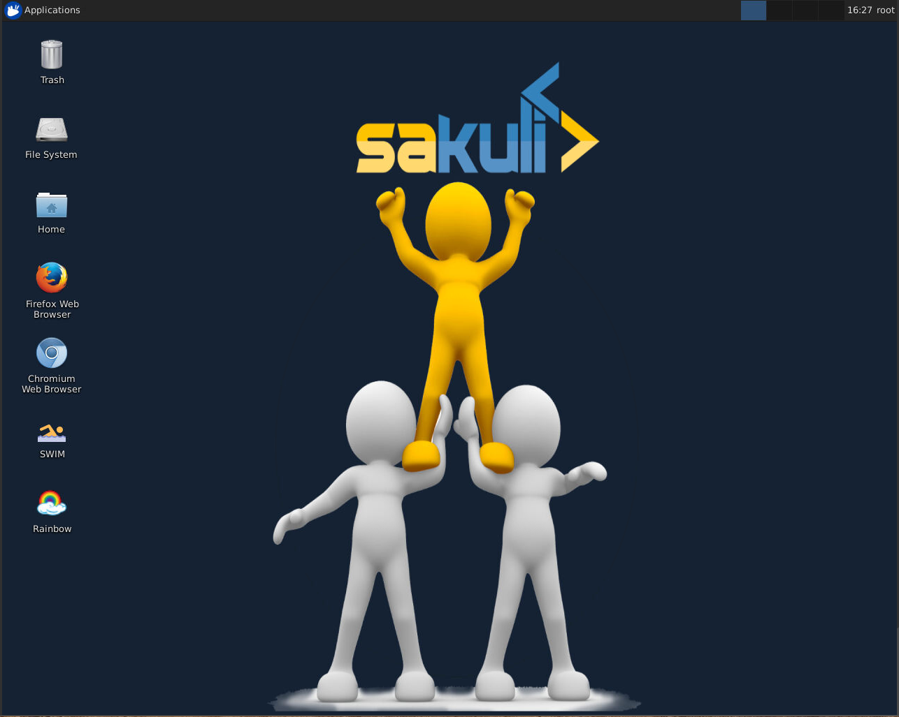
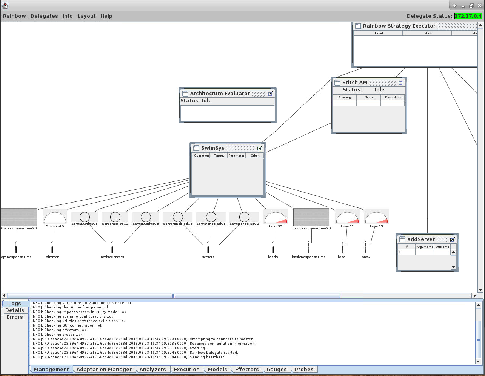
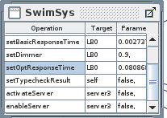
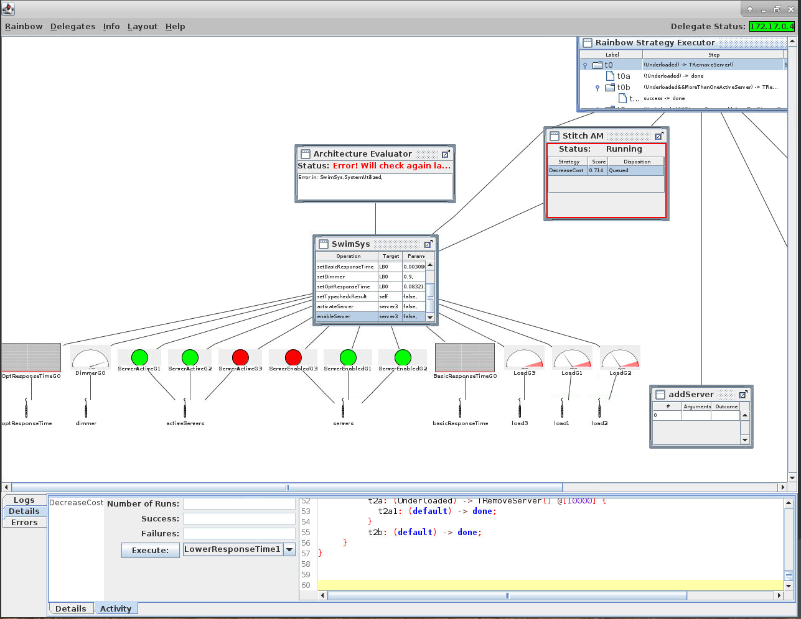

# Rainbow-SWIM example

This document provides instructions on how to build and run the docker container for a demonstration of Rainbow and SWIM.

## SWIM -  A Simulator of Web Infrastructure and Management

SWIM is a self-adaptive exemplar that simulates a web application. SWIM can be used as a target system with an external adaptation manager interacting with it through its TCP-based interface or with an adaptation manager built as a simulation module. More details can be found on [the SWIM website](https://hub.docker.com/r/gabrielmoreno/swim). 

This demonstration uses the SWIM simulator with Rainbow as the Self-Adaptive Platform

## Building SWIM-Rainbow

In the root Rainbow directory (i.e., the one that contains `deployments`, `libs`, `rainbow` etc., build the docker image using the following command:

```
> docker build -t cmuable/rainbow-example -f deployments/rainbow-example/Dockerfile .
```

This is a multi-stage docker build file that will first build a Rainbow release targeted for SWIM.

## Running Rainbow and SWIM

1. Run the docker container: 
   ```   
   > docker run -it --rm -p 6901:6901 --hostname rainbow-example cmuable/rainbow-example
   ```
2. Log into the docker container from a browser by connecting to `http://localhost:6901` (assuming you are connecting from the Docker host). You will be prompted for a password. Use `vncpassword`. After logging in, the screen should look like:

   

3. To start SWIM, double-click the SWIM logo: . This launches a GUI 
interface from which the candidate arrival traffic profile for SWIM can be selected.

   

   Double-clicking on one of the profiles will launch SWIM with that profile, starting 
   with three initial servers all serving optional content. 


4. To start Rainbow, double-click on the Rainbow logo: . This will bring up the Rainbow UI, which should look like:

   

5. Rainbow should start automatically - you will see the model being updated via operations:

   

6. Eventually, Rainbow will detect that there are too many servers for the current traffic 
and attempt an adaptation. You should see something like:

   
   This shows that a server has been removed (the two red gauge lights indicating deactivation 
   and removal). Note that the `Stitch AM` window shoes that a strategy was queued (and 
   is currently exectuing), and the `Rainbow Strategy Executor` is showing details of 
   what strategy is being executed.

7. More details about the Rainbow UI can be found in [Rainbow UI Documentation](../../../documents/ui.md) 
