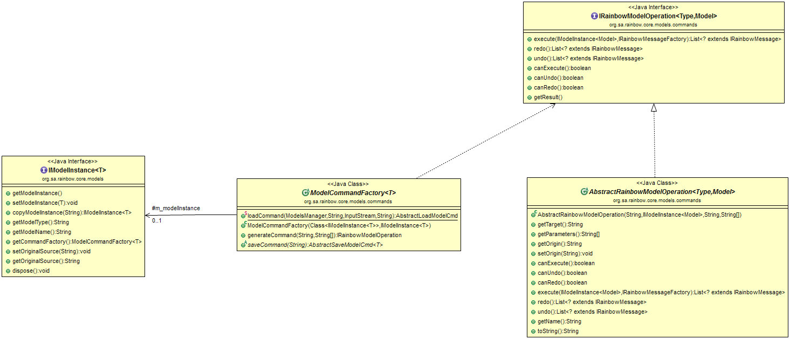

# Rainbow Yellow Specification and Deployment Guide.

## Introduction

Rainbow is a self-adaptive framework that can be used to provide self-adaptation capabilities to an existing system. Rainbow adds a closed control loop on top of a system, and then monitors and effects changes on the system based on observations. 

To place Rainbow on top of a system requires customizing it with information about the system that it is managing. This includes:

* Information about the deployment layout of the system. This is required so that Rainbow knows which machines to run on.

* A model of the system. This is specified most commonly as an Acme model of the software architecture of the system, and a set of commands that change properties in the architecture (useful for analysis) and structural aspects of the system (useful for changes)

* The analyses to be done on the system. This is a class that is used to examine the models and derive information that can be used to select an adaptation strategy.

* Gauges. The monitors used get information out of the system.

* Strategies and Tactics: Scripts used to make changes to the system.

* Utilities and preferences. Information used to decide which adaptations to perform.

This document describes how to define and install these elements.

## Customizing Rainbow to a New System

### Defining a target

To customize Rainbow to work on a particular system, a target needs to be defined and placed in the targets directory of Rainbow. The structure of a target is as follows:

<table>
  <tr>
    <td>lib/</td>
    <td>This contains the additional JAR files that are needed for probes, effectors, and gauges. Any JAR files in here will be automatically added to the classpath.</td>
  </tr>
  <tr>
    <td>model/</td>
    <td>This contains model-level information about Rainbow, including the Acme model of the system being managed (if applicable), and gauges.</td>
  </tr>
  <tr>
    <td>system/</td>
    <td>This contains the elements of the system that get used by Rainbow. In this directory, the probes and effectors are defined.</td>
  </tr>
  <tr>
    <td>stitch/</td>
    <td>This contains the strategies, tactics, and utility profiles for repairs (if applicable)</td>
  </tr>
  <tr>
    <td>rainbow.properties</td>
    <td>This file defines the various configuration properties for Rainbow, including the location and ports of the various Rainbow services, the location of the Rainbow master, where gauges, etc. configuration files are located, and additional host locations. These properties are read into Rainbow on startup and can be accessed through the Rainbow.property method in the code.</td>
  </tr>
</table>

### Adding a model

Rainbow can manage multiple models, including models of the utilities, models of the system, and models of the environment. Rainbow models are specified in the `rainbow.properties` file, with the following applicable properties:

*rainbow.model.number:* Specifies the number of models to be loaded into Rainbow on startup

*rainbow.model.path_<#>*: The target relative path to the model file. # is a number that is < rainbow.model.number-1, and indicates which model the properties correspond to. If no path is specified, then the loading command should construct an empty model

*rainbow.model.load.class_<#>*: Indicates the model command factory that will be used to load the model

*rainbow.model.name_<#>*: The name for the model in the models manager.

*rainbow.model.saveOnClose_<#>*: (Optional) Indicates whether the model should be saved when Rainbow closes

*rainbow.model.saveLocation_<#>*: (Optional) Indicates the target relative path for the model to be saved in. If this property is not specified, but saveOnClose is, then the path is used instead.

Rainbow can handle models of different types (not just Acme models as in previous versions). Adding a new model requires implementing a number of Rainbow framework classes. 

* IModelInstance<T>: Provides the framework wrapper around models that are to be used in Rainbow. The IModelInstance provides methods to enable the ModelsManager to manage the model, including copying, deleting, and attribute information about the source, type, and name of the model.

* ModelCommandFactory<T>: Models in Rainbow are updated via operations, or commands. This allows the framework to manage transactions on the model, know when commands fail, announce events based on commands, and allow gauges, analyses, and adaptations to request model changes. Model instances contains a command factory so that commands can be created. The ModelsManager is usually the only element that executes the commands: other components may create commands and request that the ModelsManager execute them (by announcing them on the Model Upstream Bus). A command factory must provide the following operations:

    * loadCommand(ModelsManager mm, String modelName, InputStream str, String source): A static method that is used by the ModelsManager to create a new ModelInstance. The ModelsManager looks for this method through reflection on the command factory referred to in the rainbow.properties file above.

    * saveCommand: A method that will produce a command that saves the model when Rainbow exits.

    * generateCommand:  Given a command name and a set of arguments (where the first argument is usually the target), return the appropriate model operation. This method looks in the command map to find the appropriate implementation of IRainbowModelOperation to construct and return. If it is not found in the command map, reflection is used to search for methods on the command factory that match the name of the operation and constructs the operation based on the return type of this method. If an operation is called "xxx", reflection looks for a method called xxxCmd.

* AbstractRainbowModelOperation<T>: An operation that can be executed on models of type T. It should implement methods to execute the operation, as well as a constructor that renders the target and arguments of the command as Strings (so that they can easily be constructed from serialization in Rainbow). 

These framework classes are related as below.

### Adding a new probe

Probes are instruments in the running system. There are two types of probes supported by Rainbow: script based probes and Java probes. In both cases, the `probes.yml` file needs to be updated with the new probe information. This file usually lives in the `system` directory of a target. The probe information consists of the following fields:

| YAML Spec | Description |
| :-------- | :---------- |
| `probes:` |  |
| &nbsp; `NewProbe:`                      | The name of the probe. |
| &nbsp; &nbsp; `alias: xxx`              | The name that the probe as seen by the gauge. Gauges will put this in the `targetProbeType` field |
| &nbsp; &nbsp; `location: <loc>`          | The location where the probe is deployed (usually a property specified in `rainbow.properties`) |
| &nbsp; &nbsp; `type: <type>`             | The type of the probe, one of `java` or `script` |
| &nbsp; &nbsp; `javaInfo:`               | For java probes, this element is used |
| &nbsp; &nbsp; &nbsp; `class: <cls>`     | The class of the probe, implementing `org.sa.rainbow.translator.IProbe` or one of its subclasses. |
| &nbsp; &nbsp; &nbsp; `period: <num>`    | The reporting period of the probe |
| &nbsp;&nbsp;&nbsp;&nbsp;&nbsp;&nbsp;`args.length:`&nbsp;`<num>` | The number of arguments that will be passed to the constructor of the probe |
| &nbsp; &nbsp; &nbsp; `args.<n>: <val>`   | The arguments to be passed, n=0..args.length-1, one field for each argument |
| &nbsp; &nbsp; `scriptInfo:`             | For script probes, this element is used |
| &nbsp; &nbsp; &nbsp; `path: 
`            | The path of the script, which should exist on `location` |
| &nbsp; &nbsp; &nbsp; `argument: <string>`        | The argument(s) to pass to the script |

For Java-based probes, the java class should be on the classpath. This means creating a JAR and placing it on the classpath. **The JAR file can be placed in the target’s lib directory. For script-based probes, the path needs to exist on the machine. **

### Adding a new Gauge

While probes provide information about the system, the intent of gauges is to abstract this system information into architectural information, in the form of commands against the model. There are three kinds of gauges in the Rainbow system: gauges that receive information from probes; gauges that receive information from other gauges; and gauges that generate information without either of these (for example, time-based gauges or diagnostic gauges). 

In all cases, gauges must be specified in the gauges.yml file located in the models directory. There are two sections that are required in this file: the gauge-types section, which defines the kinds of gauges that the system can support, and the gauge-instances section that says which instances Rainbow should create, how they are attached to the model, and what (if any) probes they listen to. For example, a gauge type could be defined for reporting the processing time property for servers. The type would define what values (e.g., processing-time) are reported by the gauge, how to set up the gauge initially (e.g., the period of reporting), and how to configure the gauge when it is running (e.g., by changing the reporting units from seconds to milliseconds). The instance specification specifies where a particular gauge instance runs, what part of the model it is attached to, what probes it is listening to, etc.

The format of the gauge-type portion of the gauges.yml spec are:

| YAML field | Description |
| :---------- | :---------- |
| `gauge-type:` |   |
| &nbsp; `NewGaugeT:`                           | The name of the gauge type |
| &nbsp; &nbsp; `commands:`                     | The command names and command signature that will be reported by the gauge. |
| &nbsp;&nbsp;&nbsp;&nbsp;&nbsp;&nbsp;`name:`&nbsp;`Type.command(...)` | The command signature is of the form `<TargetType>.<command>(<type>,...)`. Valid types are `String`, `long`, `double`, `boolean`, and sets of these specified by surrounding the type in `{..}`. `<TargetType>` is a type relative to the command being updated. Commands should be defined in the model. |
| &nbsp; &nbsp; `setupParams:`                   | The parameters used when the gauge is constructed. It is possible to define your own setup parameters, giving values in the instance, but the required ones are: |
| &nbsp; &nbsp; &nbsp; `targetIP:`               | Where a gauge instance will be run. Here the default is localhost. |
| &nbsp; &nbsp; &nbsp; &nbsp; `type: String`     |    |
| &nbsp; &nbsp; &nbsp; &nbsp; `default: "localhost"` |   |
| &nbsp; &nbsp; &nbsp; `beaconPeriod:`           | How often the gauge will send a report of its liveness to rainbow, in ms |
| &nbsp; &nbsp; &nbsp; &nbsp; `type: long`       |   |
| &nbsp; &nbsp; &nbsp; &nbsp; `default: <value>` | The default value to use in instances |
| &nbsp; &nbsp; &nbsp; `javaClass:`              | The javaClass that implements the gauge. | 
| &nbsp; &nbsp; &nbsp; &nbsp; `type: String`     |    |
| &nbsp; &nbsp; &nbsp; &nbsp; `default: <value>` | It should extend `AbstractGauge` or `AbstractGaugeWithProbes` (if it listens to probes) |
| &nbsp; &nbsp; `configParams:`                  |  The parameters used to configure the gauge, with values given in the instance. Gauges are configured in Rainbow when all the expected target locations have been created. It is possible to define your own parameters, but Rainbow understands the ones below: |
| &nbsp; &nbsp; &nbsp; `targetProbeType:`        | The probe that the gauge will listen to. This will need to be the name specified in the `alias` of the probe. |
| &nbsp; &nbsp; &nbsp; &nbsp; `type : String`    |   |
| &nbsp; &nbsp; &nbsp; &nbsp; `default: ~`       | `~` indicates null value |
| &nbsp; &nbsp; &nbsp; `targetProbeType:`        | If the gauge listens to more than one probe, their aliases are specified in the comma separated list of this config param |
| &nbsp; &nbsp; &nbsp; &nbsp; `type : String`    |   |
| &nbsp; &nbsp; &nbsp; &nbsp; `default: ~`       | `~` indicates null value |
| &nbsp; &nbsp; &nbsp; `samplingPeriod:`         | How often, in ms, the gauge will report a value. |

The instance specification for a gauge specifies its type, the model it is attached to, the mappings of values to properties on the model, and the values for any setup and configuration parameters.

| YAML field | Description |
| :--------- | :---------- |
| `gauge-instances:`                             |   |
| &nbsp; `<GaugeName>:`                            | The name that the gauge will have |
| &nbsp; &nbsp; `type: <GaugeType>`                | Which gauge type (defiend above) this gauge is an instance of |
| &nbsp; &nbsp; `model: "name:type"`               | The model to which the gauge will be attached. E.g., `“ZNewsSys:Acme”`. This will be an Acme model specified in the target.|
| &nbsp; &nbsp; `commands:`                        | For each command that the gauge issues, which instance and parameters it should be issued with |
| &nbsp;&nbsp;&nbsp;&nbsp;&nbsp;&nbsp;`“value”:`&nbsp;`element.command(params)` | `element`: the architectural element instance (of the type specified in the gauge type) to issue the command against. This can be either a fully qualified model name, or a pattern understood by the gauge. The parameters are a list of values for each parameter of the operation. Parameters of the form `${...}` are replaced by rainbow properties. Parameters of the form `$<...>` are replaced at runtime by the gauge. |
| &nbsp; &nbsp; `setupValues:`                     | 
| &nbsp; &nbsp; &nbsp; `<setupParam>: <value>`     | For each setup value specified in the type, give the value to setup. If a value is not specified, then the default value specified in the type is used. |
| &nbsp; &nbsp; `configValues:`   | |
| &nbsp; &nbsp; &nbsp; `<configParam>: <value>`    |   Like the setup values, a value is specified for each config value in the type, otherwise the default value is used. |

Gauges are only implemented using Java in the current framework. The `javaClass` specified in the type must be on the classpath for the target system. To implement the gauge, the following class hierarchy is provided by the Rainbow Infrastructure:

`AbstractGauge`: Implements basic Gauge management, such as heartbeat, configuration, setting up, etc. Gauges that do not listen to any probes should implement this class

`AbstractGaugeWithProbes extends AbstractGauge`: A gauge that handles the targetProbeType and targetProbeList configuration parameters. 

`RegularExpressionGauge extends AbstractGaugeWithProbes:` A gauge that processes probe reports that match one or more regular expressions. The constructor for the gauge should specify the regular expression patterns that are to be matched, and the gauge provides a default runAction that calls "doMatch" when a one of the expressions is matched. Extenders must implement this doMatch method to report the value.

### Adding a new Effector

Effectors are scripts or code that are run on the target system to make a change to the system (e.g., to add a server or to blacklist a client). Effectors map commands that are issued by the executor (that are expressed as model commands) and call the code when the model commands are matched. Effectors are system-specific and so are usuall defined in the `effectors.yml` file in the `system` directory of the target. The effector specification as the following format:

| YAML field | Description |
| :--------- | :---------- |
|`effectors:` |             |
| &nbsp; `<Name>:`                         | The (user-defined) name of the effector |
| &nbsp; &nbsp; `location: <loc>`          | The location where this effector will be run |
| &nbsp;&nbsp;&nbsp;&nbsp;`command:`&nbsp;&quot;`<pattern>"`        | The model command that the effector will match on. The pattern is usually of the form `<location>.commandName(<arg1>, <arg2>, ...)`. If location is omitted, then this matches any published operation sent to the `location`. If it is `*` then it matches any command sent to any location. If `<argN>` is of the form `$<..>`, then the effector matches the command argument matching any value. If the argument is a value, the effector will only fire if the argument in the published command matches exactly. For example, `"Comp.operation ($<val>, true)"`  will match any `operation` sent to `Comp` where the second argument is `true`. THe first argument is stored in `$<val>`, which may be used later in the specification |
| &nbsp; &nbsp; `type: <type>`                | The type of the effector, either `script` or `java` |
| &nbsp; &nbsp; `scriptInfo:`                 | If the type is `script` then this element is used |
| &nbsp; &nbsp; &nbsp; `path: <path>`         | The path on the target location to find the script to run |
| &nbsp; &nbsp; &nbsp; `argument: "<arg>"`      | The argument to pass to the script. If the argument contains `$<..>` then this is replaced by the corresponding argument in the command. If the argument is of the form `{N}` then it will be replaced with the Nth argument in the matched commandName. |
| &nbsp; &nbsp; `javaInfo:`                   | If the type is `java` then this block is used |
| &nbsp; &nbsp; &nbsp; `class: <cls>`         | The java class used to implement the effector, which runs in the Rainbow delegate on the location |
| &nbsp; &nbsp; &nbsp; `args.length: <num>`   | THe number of commands that are to be passed to the constructor of the class |
| &nbsp; &nbsp; &nbsp; `args.<N>: <val>`       | The argument value to pass as the Nth paramter to the constructor |

Note that there is a prototype form of typing effectors. Effector types can be defined in the the `effector-types:` block of the file (similar to `gauge-types`). Effector types have the same form as effectors - the values from the type are copied into the instance. An effector instance can refer to a type via the `effector-type:` attribute which should be at the same level as `location` attribute in the effector block.

### Adding Stitch

For Rainbow instantiations that use Acme models and Stitch-based adaptation, the scripts should be defined in the `stitch` directory of targets. All files with the extension `.s` will be loaded. Unfortunately, there is little documentation on the syntax of Stitch. There are a number of examples in the `targets` directory of this repository, and the paper [Stitch: A Language for Architecture-Based Self-Adaptation](http://acme.able.cs.cmu.edu/pubs/show.php?id=341) provides illustrations of the syntax. However, a number of things have changed since the paper was published. For example, Stitch can now refer to [Acme paths](paths.md) to query Acme models, and there are some new things that are described in [New and Noteworthy](../NewAndNoteworthy.md#stitch-language-changes) 

