# New Rainbow GUI

We have developed a new Rainbow GUI that is more than a set of log windows. The aim 
of this GUI is to:

- provide information about the connectedness between certain components in Rainbow 
  (e.g., which probes are sending information to which gauges).
- display information about how each component was configured in Rainbow.
- show dynamically what is happening in Rainbow as adaptations are occuring

The GUI is also customizable to different instantiations of Rainbow.

Note that this GUI is in beta (even more than Rainbow). It is used in the Simple Example 
that is provided.

## Main Rainbow Window

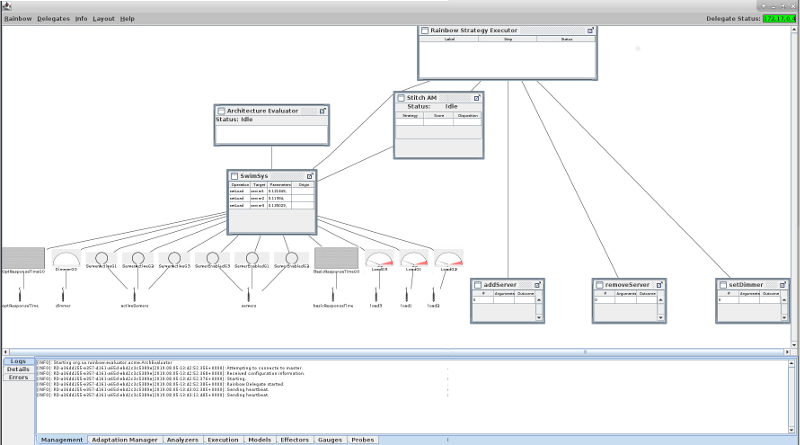

The Rainbow Window is divided into three main parts:

1. The **menu bar and status**. The status of each Rainbow delegate (i.e., Rainbow agent 
running on any machine, including the local) is displayed to the right.
2. The **Rainbow canvas** depicts the connection diagram of all Rainbow components. Probes 
and effectors are shown at the bottom of this window (because they interact directly 
with the system). Gauges are shown above probes. The model(s), analyzer(s), adaptation 
manager(s), an executor(s) are then laid out showing how they are connected.
3. The **selection pane**, which displays information about Rainbow and also the selected 
elements in the Rainbow window. The selection window has three tabs:
    1. The _Logs_ tab displays the consolidated logs of each kind of component in Rainbow 
    (similar to the old Rainbow GUI).
    2. The _Details_ tab displays details associated with the the selected element 
    in the Rainbow window.
    3. The _Errors_ tab displays any errors that Rainbow has produced.

### Probe UI

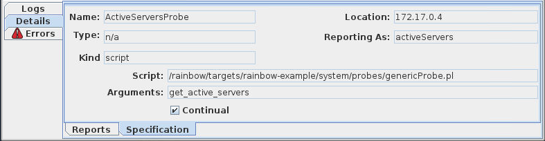

Probes are represented by the  icon. When selecting a 
probe, the focus of the selection pane will display its details in the _Details_ tab. 
This tab has two parts:

1. __Reports__: Displays the probe reports that the probe has given so far. These are 
usually the string that the probe writes on the Probe Bus that is consumed by a gauge.
2. __Sepcification__: Displays the specification details of the probe, as specified 
in the _probes.yml_ file of the target. This displays the name, location, how it is 
referred to by a gauge, and what is executed by this probe (in the example, it is a 
script).

### Gauge UI

Gauges take probe reports as input and produce operations to update a model as output. 
In the Rainbow window, the probes that are reporting to gauges and the model that a 
gauge updates are connected to the gauge. Gauges can have four different visual depictions 
in the window, and are specified in the UI specification file (see UI Customization 
section).

| Icon | Meaning   | Type in specification   |
| --- | --- | --- |
|  | Default Image | No specification |
| 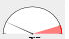 | Meter | `dial` |
| 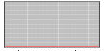 | Time Series | `timeseries` - shows the values over time |
| 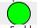 | Binary | `onoff` - Shows a value that toggles between true and false

When selecting a gauge, the _Details_ tab contains two parts:

1. **Operations**, which displays the operations that the gauge as emitted to change 
the model it is connected to.

  

2. **Specification**, which displays how the gauge was specified, including the operations 
it is allowed to emit, the Java class implementing the gauge, how it was configured, 
and how it was set up.

  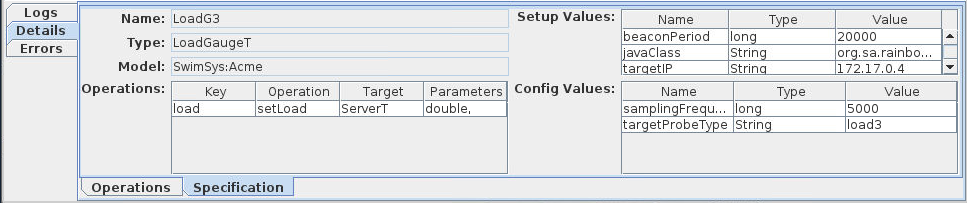

### Model UI

Each model in the Rainbow window shows the operations and target table that gives the most 
recent operation that was given for that operation and target. 

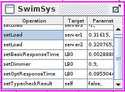

When selecting the model, the **Operations** tab shows the list of operations (ordered 
by most recent) that have been executed by the model.

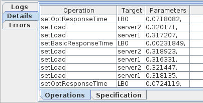

The **Specification** tab shows the source for the model, as well as the valid operations 
on that model.

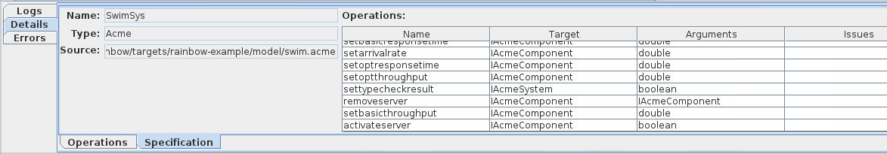

### Effector UI

Effectors perform actions on the system in response to operations published by executors. 
The entry on the Rainbow window for an effector is a table of the number of times it 
has been executed, the parameters passed to it, and whether it completed successfully 
or not.

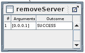

In the selection pane, the specification for the effector is displayed. It shows the 
name of the effector, the operation it executes in response to, and what the effector 
executes (e.g., a script on some machine).
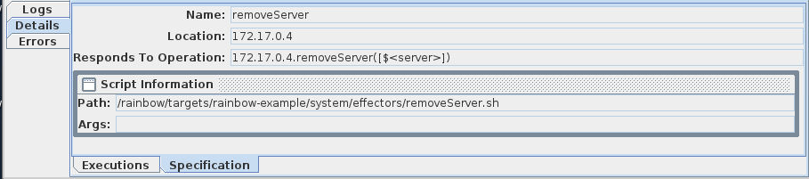 

__For the next three types of components, the user interface needs to be customized 
for the specific component. In the following sections we assume that Rainbow is being 
used in the classic case, where the analyzer is doing architectural analysis, and the 
architecture manager and executor use the DSL _Stitch___

### Analysis UI
The analysis UI shows output from the architectural analysis of a model. The status 
shows the current state of the architectural analysis. Underneath, if there are errors, 
an indication of the error is displayed there.

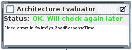


### Adaptation Manager UI

The adaptation manager chooses which strategy to execute in response to an error. The 
element in the Rainbow window lists the history of the strategies that have been chosen by 
Rainbow, what the final utility is predicted to be, and, once executed, whether the 
strategy was successful or not.

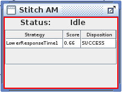

The Selection pane for the adaptation manager shows four tabs.

- _Activity_ currently shoes the log messages that the planner produces.
  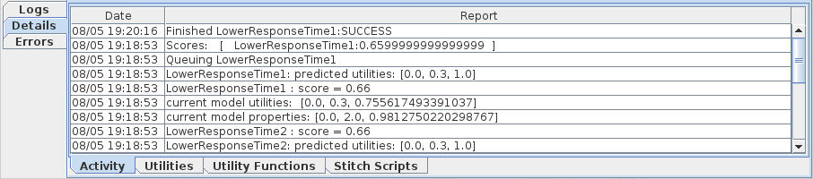
- _Utilities_ shows the utility preferences and scenarios that are defined within rainbow, 
and the impact vectors for each of the tactics.
  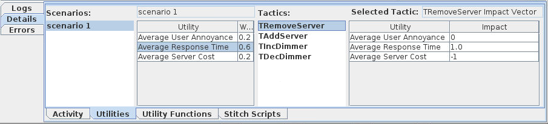
- _Functions_ shows the utility functions, that map values for a quality to a preference 
value between [0,1]. 
  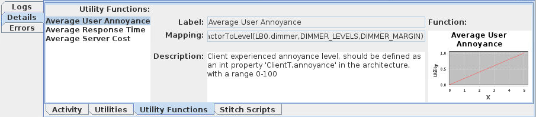
- _Stitch Scripts_ displays the Stitch Scripts that Rainbow knows about.
  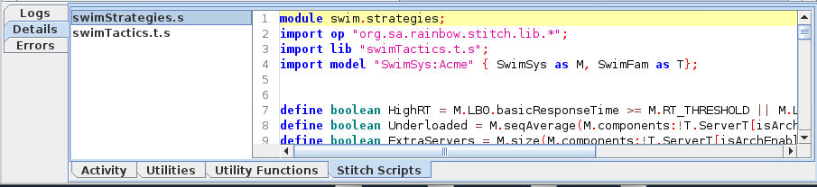

### Executor UI

The executor managers the execution of the strategy. In the Rainbow window, the most 
recently executed strategy is displayed in a tree. The branches that were executed 
are highlighted in blue and the result of each node is displayed in the far right.


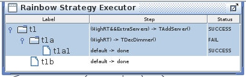


## UI Customization

The UI can be customized in a number of ways, in keeping with the customization of Rainbow 
more generally. To use the GUI in a rainbow instantation, you should specify the following 
in the relvant `rainbow.properties` file for the target:

```
rainbow.gui = org.sa.rainbow.gui.RainbowWindoe
```
In addition you can specify the UI customization file:

```
rainbow.gui.specs = ui.yml
```
### Gauge UI customization

Gauges can be shown in a number of builtin ways on the Rainbow canvas. This is specified 
in the `gauges` section of the customization file. For each gauge type you want to customize, 
you can specify the way it should be presented on the canvas in the following way:

```
gauges:
  <GAUGE_TYPE>: # The type of the gauge as defined in gauges.yml
    builtin:
      category: meter | timeseries | onoff # The kind customization
      command: <COMMAND> # A command specified like in the gauges.yml
                         # This command will specify the value origin
                         # e.g., ServerT.setLoad(<$load>)
      value: <VALUE>     # which part of the command is used as the
                         # value to display, e.g., $<load> above
      upper: <NUMBER>    # The upper limit of the depicition
      lower: <NUMBER>    # The lower bound of the depiction
      threshold: <NUMBER> # The threshold to display
     # Note that the last three are not relevant for onoff category
```

### Other elements

Other elements on the canvas can be customized to use a particular class for a particular 
component. Valid kinds of elements are `analyzers`, `managers`, `executors`. For example, 
to customize how a Stitch-based adaptation manager should be displayed, the following 
would be specified in the YAML file:

```
managers:
  org.sa.rainbow.stitch.adaptation.AdaptationManager: org.sa.rainbow.stitch.gui.manager.ArchStitchAdapationManager
```

This means that if an Adaptation Manager instantiates `org.sa.rainbow.stitch.adaptation.AdaptationManager` 
then the GUI will instantiate the class `org.sa.riainbow.stitch.gui.manager.ArchStitchAdaptationManger`. 
Each of these classes should extend a `JPanel`, and may implement `IUIReporter`.

### Details 
In addition to customizing how elements are displayed on the canvas, how their details 
are presented in the Detals pane can also be specified. For example, to change the way 
adaptation manager details are shown:

```
details:
  managers: org.sa.rainbow.stitch.gui.manager.StitchAdaptationManagerTabbedPane
```

This should extend the class `org.sa.rainbow.gui.arch.elements.AdaptationManagerTabbedPane`